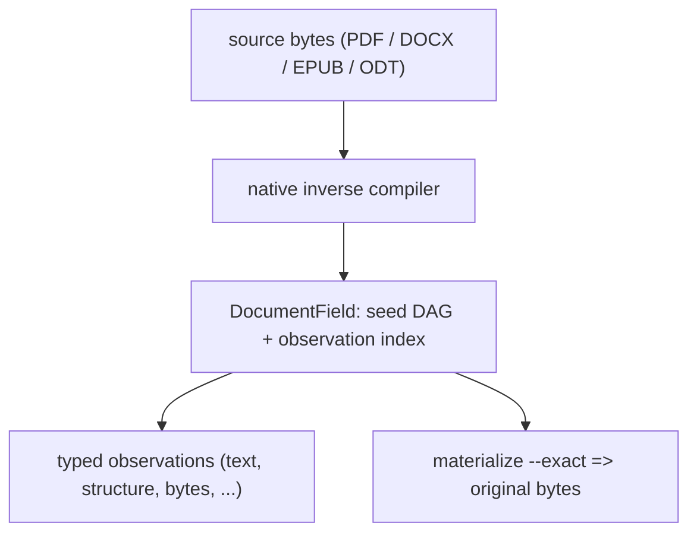

# VOLE-Document

A persistent procedural document runtime with byte-exact reconstruction:
`materialize(descriptor) == original_bytes`, always.

VOLE-Document inverse-proceduralizes a document into a **bounded deterministic
reconstruction description** — reconstruction structure, parameters/state, typed
residual channels, and typed rANS channels — persists the recovered procedural
state as a queryable **document field**, and lets you query it directly (page
text, structure, preview, streams, objects, revisions, exact byte ranges) with a
typed observation API, per-answer provenance, and `EXPLAIN`/`EXPLAIN ANALYZE`.

The forward direction is ordinary: a file is opened, parsed, and rendered. VOLE
runs it backwards. It recovers the *computation that would produce these exact
bytes* and stores that computation instead of the file — as a reconstruction
program plus typed residual and entropy channels — then materializes the original
bytes only when asked. Because the reconstruction is a program, the persisted
document becomes a **field** that can answer many typed questions directly,
without re-opening, re-parsing, or re-rendering the source.

The governing invariant of the exact profile is uncompromising:

```text
descriptor:       materialize(descriptor) == original_bytes
persistent field: materialize(field_root)  == original_bytes
```

Parsing successfully, producing "the same" text, the same object graph, the same
pages, the same rendering, or a canonical re-save are **not** substitutes. Every
exact court requires all three of equal length, equal SHA-256, and `cmp` byte
equality. Compression is an implementation detail here, not the product: rANS is
the entropy substrate *beneath* the representation, never the procedural model.
This project is neither a compressor nor a database — whole-file size and
database style both lose, and the losses are recorded (see
[Findings](docs/project/findings.md)).

## Why this matters

Document-heavy AI systems repeatedly turn the same source material into temporary working representations. A document may be parsed for ingestion, extracted into text, divided into chunks, indexed for retrieval, converted for another consumer, rendered for visual inspection, cached, and then partially reconstructed again when a later task needs different information.

A typical lifetime can involve the same underlying document passing repeatedly through work such as:

```text
parse
extract
chunk
index
convert
render
cache
re-read
re-extract
re-contextualize
```

Each representation is useful, but most captures only one view of the document and much of the computation that produced it is discarded. A later operation that needs a different view often starts again from the source or from another derived representation.

VOLE-Document explores a different lifetime model:

```text
source document
      ↓
inverse once
      ↓
persistent reconstructive state
      ↓
observe only what this computation needs
      ↓
text / structure / tables / resources / provenance / exact bytes
```

The document is inverse-compiled into durable computational state rather than treated only as an opaque file to be repeatedly decoded. That state retains enough information to reconstruct the exact original bytes while also exposing narrower observations directly through the document field.

This creates the possibility of carrying useful work forward across the lifetime of a document. Parsing decisions, recovered structure, provenance, package relationships, native format structure, and derived observations can become persistent state rather than transient products of a single request.

The long-term question is therefore not only how cheaply a document can be stored, but how much repeated work can be avoided when the same document participates in many computations over time:

```text
traditional lifetime

source
 ├─ parse → text
 ├─ parse → chunks
 ├─ parse → structure
 ├─ parse → tables
 ├─ render → preview
 ├─ parse → provenance
 └─ reopen → exact source


VOLE lifetime

source
   ↓
persistent DocumentField
   ├─ text
   ├─ chunks / blocks
   ├─ structure
   ├─ tables
   ├─ resources
   ├─ provenance
   ├─ previews
   └─ exact source
```

This matters most for workloads that repeatedly revisit heterogeneous documents and ask different questions of them: retrieval systems, document agents, research systems, technical knowledge bases, compliance and audit workflows, and long-lived document infrastructure.

The economic hypothesis is measurable: **if enough useful document computation can be retained in compact procedural state, the cumulative cost of repeated parsing, extraction, materialization, I/O, and model context can fall over the lifetime of the document.** VOLE-Document measures that hypothesis directly rather than assuming it. The repository records the regions where the field wins, ties, declines, or loses against direct tooling and persistent database baselines.

Exact source closure is part of that model. A narrower observation never has to become the archival authority for the document: the persistent field can answer derived questions while retaining a verified path back to the original bytes.

## How it works



Source bytes enter a **format-native inverse compiler** (a PDF physical scanner,
a WordprocessingML inverse, a bounded-XHTML/OCF inverse, or a bounded
OpenDocument (ODF) inverse over a shared
byte-authoritative ZIP layer). The recovered state is persisted as a
content-addressed **procedural seed DAG** plus a bounded **observation index**.
Queries resolve their minimum dependency closure and materialize as late as
possible; the exact whole document is just one observation
(`FullExactDocument`) among many. Authority is layered and never confused: the
DRA plus `INTEGRITY` is normative for reconstruction, the seed DAG is normative
for observations, indexes are advisory, and the derived cache is disposable
(ADRs [0024](docs/adr/0024-document-field-authority.md),
[0029](docs/adr/0029-multi-format-authority-model.md)).

## What it does

| Capability | What it means |
|---|---|
| Exact reconstruction | `materialize(descriptor)` and `materialize(field_root)` equal the original bytes (length + SHA-256 + `cmp`). |
| Inverse proceduralization | Recovers a bounded DRA reconstruction program plus typed residual and order-0 rANS channels from the document. |
| Persistent field | Stores the recovered state as a content-addressed seed DAG that survives deletion of the source. |
| Typed observations | Selectors (document / page / object / stream / revision / byte-range / text-match) × representations (metadata / text / structure / operators / encoded / decoded / exact / preview). |
| Provenance | Every answer carries a typed basis, scope, dependency ids, and exact source spans. |
| `EXPLAIN` | `explain` shows the intended plan; `explain --analyze` reports the actual work (bytes read by class, nodes executed vs reused, decodes, wall/CPU). |
| Partial materialization | Serves one byte range, object, stream, or revision from an advisory seek `DIRECTORY` + observation index without materializing the whole document. |
| Multi-format | One field vocabulary over PDF, DOCX, EPUB and ODT, with retained native structure and `format=…;common;…` provenance. |
| Hostile-input contract | Typed errors, checked arithmetic, bounded resources, fail-closed unknowns; the decoder never executes document content. |

## Supported formats

| Format | Physical layer | Native inverse | Exact | Common observations |
|---|---|---|---|---|
| PDF | owned lexer + physical span scanner | objects, streams, revisions, page tree, `/ObjStm` | yes | `metadata`, `text`, `find` |
| DOCX | shared byte-authoritative ZIP + OPC | WordprocessingML stories, paragraphs, runs, tables, notes, tracked changes | yes | `metadata`, `text`, `heading`, `block`, `table`, `cell`, `resource`, `link`, `find` |
| EPUB | shared byte-authoritative ZIP + OCF | package, manifest, spine, bounded XHTML | yes | `metadata`, `text`, `heading`, `block`, `table`, `cell`, `resource`, `link`, `find` |
| ODT | shared byte-authoritative ZIP + ODF | OpenDocument: paragraphs, headings, lists, tables, notes, tracked changes, sections | yes | `metadata`, `text`, `heading`, `block`, `table`, `cell`, `resource`, `link`, `find` |
| XLSX, PPTX, others | — | — | PROPOSED | — |

"Universal" means the observation vocabulary is shared across the four
implemented formats, **not** that every format is supported. Details and
capability gaps: [Format support](docs/reference/format-support.md).

## Quick start (Docker only)

All commands run inside pinned containers; the host only invokes Docker.

```sh
# Build the pinned toolchain image, then run the gate
docker compose build dev
docker compose run --rm --no-TTY dev cargo test --all-features --locked
docker compose run --rm --no-TTY dev cargo clippy --all-targets --all-features -- -D warnings
```

End-to-end: ingest a document, inspect and run an observation, then reconstruct
the exact bytes.

```sh
# 1. Wrap the source in the exact container (RAW accepts any bytes; the format
#    is detected from the bytes, never the extension).
docker compose run --rm --no-TTY dev \
  ./target/debug/vole-document encode --force raw report.docx report.docx.voldoc

# 2. Inverse-proceduralize into a persistent field. Prints the field id (HEX).
docker compose run --rm --no-TTY dev \
  ./target/debug/vole-document field-ingest report.docx.voldoc --store /tmp/field

# 3. Show the plan, then run it and measure the actual work.
docker compose run --rm --no-TTY dev \
  ./target/debug/vole-document explain --store /tmp/field --field "$FIELD" --block 1 --kind text --analyze

# 4. Query one observation (text, structure, table cell, …).
docker compose run --rm --no-TTY dev \
  ./target/debug/vole-document observe --store /tmp/field --field "$FIELD" --block 1 --kind text

# 5. Reconstruct the exact original bytes — length + SHA-256 + cmp all match.
docker compose run --rm --no-TTY dev \
  ./target/debug/vole-document materialize --store /tmp/field --field "$FIELD" --exact --output report.docx.out
```

`explain --analyze` for a narrow observation reports
`whole_source_materialized: false` — the field answered from its minimum closure,
not by re-materializing the document. The full CLI surface is in
[CLI](docs/reference/cli.md).

The two-step `encode` → `field-ingest` path above is the **archival** route: it
prices the whole candidate portfolio. For **runtime** ingestion,
`field-build INPUT --store DIR [--profile runtime] [--packed] [--sync=batch|each]`
builds the exact authority and the field in **one process** with **no candidate
search** (the fixed `RAW` floor) — measured ~2× faster and ~3× lower peak RSS at
identical exactness and observations, and the path used for the full-population
build ([ADR-0051](docs/adr/0051-direct-field-ingestion.md), Phase 19).

## Current status

Release **`0.1.0-alpha.25`** (Phases 13–20 complete; see [Changelog](docs/project/changelog.md)). **Phase 15** repaired the frozen `real100-v1` court and measured the frontier; **Phase 16** adopted the recommended backend, fixed the large-PDF encode pathology, and corrected the storage accounting ([Phase 16 results](docs/phases/phase-16-results.md)); **Phase 17** added a direct source → field build path and a PDF revision-lineage surface ([Phase 17 results](docs/phases/phase-17-results.md)); **Phase 18** is a **build-cost programme** that removed unnecessary work step by step — compression search → redundant materialization → re-serialize → **per-node durability sync** — and **inverted the equal-contract build position** ([Phase 18 results](docs/phases/phase-18-results.md); [ADR-0053](docs/adr/0053-batched-packed-sync.md)); **Phase 19** is a **measurement-discipline phase** that re-read those headlines with paired, interleaved repetitions across both lanes and ran the direct build over the full frozen population ([Phase 19 results](docs/phases/phase-19-results.md); [ADR-0054](docs/adr/0054-repeatability-and-paired-measurement.md)); **Phase 20** is a **hardening-and-economics phase** that **adversarially attacks** the packed store's durability (1,300 fault-injection cases, 0 fail, scope stated), cuts large-source peak memory **33 %** so a **~1 GiB source now ingests**, records the warm loss as **durable**, and **closes C4b** with a typed external layer ([Phase 20 results](docs/phases/phase-20-results.md); [ADR-0055](docs/adr/0055-external-context-typed-external-metadata.md)). **`zlib-rs` is the shipped inflate backend** (byte-identical; `field-ingest` **0.917×**; ADR-0045 fulfilled) and the **`>100 MiB` PDF encode pathology is fixed** (`nasa-pdf-0001` byte-exact, peak/input **17.7× → 8.9×**; ADR-0041 extended).
**Qualified equal-contract position (estimator and interval stated):** VOLE **builds faster** — paired per-rep median **0.18** (95% CI **0.10–0.23**, entirely below 1.0; 11 win / 0 tie / 1 loss) — though the ratio-of-sums reading is **~0.96×** because one heavy document dominates VOLE's *total*; the win is real, its magnitude is estimator-dependent. VOLE **stores `0.53×`** SQLite on the 12-document contract subset but **~0.96×** on the full `real100-v1` (the `field-build` path **fixes** the runtime/RAW program rather than **searching** for the smallest), **ties** on cold queries, and is a **modest `~1.29×`** slower on the warm one-session lane — now **diagnosed** as the one-time full `Descriptor::parse` that decoder authority requires and **recorded durable** (a paired N=100 before/after change is a NULL; the park sits below the court's resolution). The direct build is **100/100 built and 100/100 exact** on the frozen corpus; **memory was the next binding constraint**, and Phase 20 removed a redundant source-sized copy (**peak RSS/source 5.998× → 3.997×**) so a **~1 GiB source now ingests** (a 1 GiB synthetic that OOM-killed now completes at 4099 MiB, ~2 GiB headroom; no cap raised). The Phase-18 durability win is now **adversarially attacked**: **1,300 fault-injection cases, 0 fail, 0 critical** — ordering, no-partial-node, prefix-exact recovery and corruption fail-closed are **proven**; true power loss and torn rename are **not** (page cache survives `SIGKILL`; `write_atomic` never dir-fsyncs). The earlier two-step `10.74×` and the 17.1 `field-build 2.04×` are **not composable**.
**Negatives / open:** **C4a is answered** (document-native lineage; typed unsupported for docx/epub, and byte-derivable from the baseline's retained blob — a work-location difference) and **C4b closes** under an equal external input through a typed `ExternalContext` stored **beside** the field (never in the seed DAG, index, manifest, or exactness authority) ([ADR-0055](docs/adr/0055-external-context-typed-external-metadata.md)). Residency still wins only below ~1 MiB (cold 6 ms vs resident 9 ms; ADR-0042) and the open substrate question ([ADR-0050](docs/adr/0050-sqlite-as-substrate-question.md)) is unchanged. **CUDA is deferred** (ADR-0048). VOLE holds `pdf`/`text_repeat` and `docx`/`table`, and loses the rest to SQLite/FTS. Headline measurements, each with its own results doc:

1. **Exactness holds after the source is gone.** PDF, DOCX and EPUB
   rematerialize byte-for-byte (length + SHA-256 + `cmp`) after the source *and*
   the descriptor are deleted, in a fresh process: removal **38/38**, triplet
   **96/96** ([Phase 12 results](docs/phases/phase-12-results.md)).
2. **Warm observations are cheap.** A repeated narrow observation reads **0**
   descriptor bytes and adds **8.4–8.9 KB** of descriptor-free overhead at
   **~99 µs** wall — an *overhead-only* figure that excludes the cached answer
   payload it also reads ([Phase 11 results](docs/phases/phase-11-results.md)).
3. **Small-document lifetime is a scoped win.** On a self-authored 841 B–61 KB
   corpus, the field beats direct per-query tooling and the cold one-time
   baseline; the source-retaining SQLite+FTS5 baseline wins the large-document
   frontier and wall/CPU at N=1000 ([Phase 12 results](docs/phases/phase-12-results.md)).
4. **Whole-file size is a recorded loss.** The best VOLE lane beats
   gzip/zstd/xz/brotli on **0/27** files; the best generic compressor is smaller
   on every file ([Findings](docs/project/findings.md)).
5. **Cross-document durable work reuse is a recorded negative (`N3`).** The warm
   reuse fraction `0.339907` falls to **0.0** after `cache --clear`; only exact
   *representation identity* is shared ([Phase 12 results](docs/phases/phase-12-results.md)).

Current limitations:

- **Not a compressor.** Whole-file size loses to generic lossless tools on every
  measured file (the representation is coarser than LZ77).
- **Not a database.** A source-retaining SQLite+FTS5 baseline wins the
  large-document byte frontier and wall/CPU at N=1000.

- **Self-authored corpora through Phase 12; first real-corpus court run.** Published performance results through Phase 12 use self-authored deterministic corpora.
  `real100-v1` is a frozen 100-document NASA/NIST corpus selected independently of VOLE performance; its Phase-15 (repaired, release-binary) frontier court is mixed
  — VOLE wins `pdf` repeated text and `docx` tables and loses cold lookups, headings, resources, metadata and exact reconstruction. The `>100 MiB` PDF **encode**
  pathology is fixed in Phase 16 (`nasa-pdf-0001` completes byte-exactly; ADR-0041 extended), though its two largest peers still exceed the **wall** op budget, not memory.
  A real EPUB-content loss (the XHTML `DOCTYPE` the policy forbade) was found and fixed (13.7, ADR-0040); residual non-DOCTYPE EPUB declines remain
  ([frontier report](docs/evidence/real100-frontier-report.md)).
- **Partial reusability.** Cross-document durable *work* reuse is a negative, and
  XLSX/PPTX and other adapters remain `PROPOSED`.

## Documentation

- [Documentation index](docs/README.md) — the map.
- [Architecture](docs/architecture/overview.md) — what the system is today.
- [Formats](docs/formats/pdf.md) — PDF, DOCX, EPUB, ODT authority boundaries.
- [Specification](docs/reference/specification.md) — the `.voldoc` wire format.
- [Conformance](docs/reference/conformance.md) — courts, invariants, fuzzing.
- [Findings](docs/project/findings.md) — consolidated positive and negative results.
- [Status ledger](docs/project/status.md) — the single authoritative status table.
- [Security](docs/SECURITY.md) — threat model and hostile-input contract.

## Reproducibility

Everything runs in digest-pinned Docker services (`compose.yaml`); nothing runs
on the host. Each sealed run under `evidence/campaigns/<date>-<phase>-<gitsha>/`
records the base image digest, `rustc`/`cargo` versions, `Cargo.lock` SHA-256, git
commit and dirty state, CPU architecture, oracle versions, and the exact command.
Receipts are immutable: corrections are amendments, never rewrites. The docs
themselves are checked by
[`tools/check-docs.sh`](tools/check-docs.sh).

## Repository layout

```text
src/        one crate; modules for architectural separation
tests/      exact / malformed / conformance courts
fuzz/       cargo-fuzz coverage-guided targets (excluded from the crate)
tools/      court, gate, and doc-check scripts (run inside Docker)
docs/       architecture, formats, reference, ADRs, phases, reviews, project
evidence/   immutable campaign receipts (machine-readable)
research/   LOCAL ONLY — gitignored (paper, snapshots, subagent findings)
```

## License and citation

Dual-licensed under either MIT or Apache-2.0, at your option. See
[`LICENSE-MIT`](LICENSE-MIT) and [`LICENSE-APACHE`](LICENSE-APACHE). Citation
metadata is in [`CITATION.cff`](CITATION.cff).

**Third-party license note.** The opt-in `deflate-replay` feature depends on
`preflate-rs`, which depends on `cabac` (LGPL-3.0-or-later). The default build
(`default = ["rans", "store", "field"]`) is permissive-only. A binary built with
`--features deflate-replay` (or `--all-features`) links LGPL code and carries the
corresponding obligations (ADR-0014).
