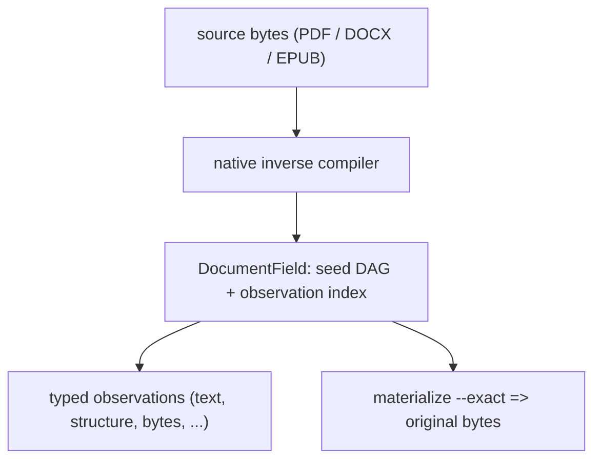

# VOLE-Document

A persistent procedural document runtime with byte-exact reconstruction:
`materialize(descriptor) == original_bytes`, always.

VOLE-Document inverse-proceduralizes a document into a **bounded deterministic
reconstruction description** — reconstruction structure, parameters/state, typed
residual channels, and typed rANS channels — persists the recovered procedural
state as a queryable **document field**, and lets you query it directly (page
text, structure, preview, streams, objects, revisions, exact byte ranges) with a
typed observation API, per-answer provenance, and `EXPLAIN`/`EXPLAIN ANALYZE`.

The forward direction is ordinary: a file is opened, parsed, and rendered. VOLE
runs it backwards. It recovers the *computation that would produce these exact
bytes* and stores that computation instead of the file — as a reconstruction
program plus typed residual and entropy channels — then materializes the original
bytes only when asked. Because the reconstruction is a program, the persisted
document becomes a **field** that can answer many typed questions directly,
without re-opening, re-parsing, or re-rendering the source.

The governing invariant of the exact profile is uncompromising:

```text
descriptor:       materialize(descriptor) == original_bytes
persistent field: materialize(field_root)  == original_bytes
```

Parsing successfully, producing "the same" text, the same object graph, the same
pages, the same rendering, or a canonical re-save are **not** substitutes. Every
exact court requires all three of equal length, equal SHA-256, and `cmp` byte
equality. Compression is an implementation detail here, not the product: rANS is
the entropy substrate *beneath* the representation, never the procedural model.
This project is neither a compressor nor a database — whole-file size and
database style both lose, and the losses are recorded (see
[Findings](docs/project/findings.md)).

## How it works



Source bytes enter a **format-native inverse compiler** (a PDF physical scanner,
a WordprocessingML inverse, or a bounded-XHTML/OCF inverse over a shared
byte-authoritative ZIP layer). The recovered state is persisted as a
content-addressed **procedural seed DAG** plus a bounded **observation index**.
Queries resolve their minimum dependency closure and materialize as late as
possible; the exact whole document is just one observation
(`FullExactDocument`) among many. Authority is layered and never confused: the
DRA plus `INTEGRITY` is normative for reconstruction, the seed DAG is normative
for observations, indexes are advisory, and the derived cache is disposable
(ADRs [0024](docs/adr/0024-document-field-authority.md),
[0029](docs/adr/0029-multi-format-authority-model.md)).

## What it does

| Capability | What it means |
|---|---|
| Exact reconstruction | `materialize(descriptor)` and `materialize(field_root)` equal the original bytes (length + SHA-256 + `cmp`). |
| Inverse proceduralization | Recovers a bounded DRA reconstruction program plus typed residual and order-0 rANS channels from the document. |
| Persistent field | Stores the recovered state as a content-addressed seed DAG that survives deletion of the source. |
| Typed observations | Selectors (document / page / object / stream / revision / byte-range / text-match) × representations (metadata / text / structure / operators / encoded / decoded / exact / preview). |
| Provenance | Every answer carries a typed basis, scope, dependency ids, and exact source spans. |
| `EXPLAIN` | `explain` shows the intended plan; `explain --analyze` reports the actual work (bytes read by class, nodes executed vs reused, decodes, wall/CPU). |
| Partial materialization | Serves one byte range, object, stream, or revision from an advisory seek `DIRECTORY` + observation index without materializing the whole document. |
| Multi-format | One field vocabulary over PDF, DOCX and EPUB, with retained native structure and `format=…;common;…` provenance. |
| Hostile-input contract | Typed errors, checked arithmetic, bounded resources, fail-closed unknowns; the decoder never executes document content. |

## Supported formats

| Format | Physical layer | Native inverse | Exact | Common observations |
|---|---|---|---|---|
| PDF | owned lexer + physical span scanner | objects, streams, revisions, page tree, `/ObjStm` | yes | `metadata`, `text`, `find` |
| DOCX | shared byte-authoritative ZIP + OPC | WordprocessingML stories, paragraphs, runs, tables, notes, tracked changes | yes | `metadata`, `text`, `heading`, `block`, `table`, `cell`, `resource`, `link`, `find` |
| EPUB | shared byte-authoritative ZIP + OCF | package, manifest, spine, bounded XHTML | yes | `metadata`, `text`, `heading`, `block`, `table`, `cell`, `resource`, `link`, `find` |
| ODT, others | — | — | PROPOSED | — |

"Universal" means the observation vocabulary is shared across the three
implemented formats, **not** that every format is supported. Details and
capability gaps: [Format support](docs/reference/format-support.md).

## Quick start (Docker only)

All commands run inside pinned containers; the host only invokes Docker.

```sh
# Build the pinned toolchain image, then run the gate
docker compose build dev
docker compose run --rm --no-TTY dev cargo test --all-features --locked
docker compose run --rm --no-TTY dev cargo clippy --all-targets --all-features -- -D warnings
```

End-to-end: ingest a document, inspect and run an observation, then reconstruct
the exact bytes.

```sh
# 1. Wrap the source in the exact container (RAW accepts any bytes; the format
#    is detected from the bytes, never the extension).
docker compose run --rm --no-TTY dev \
  ./target/debug/vole-document encode --force raw report.docx report.docx.voldoc

# 2. Inverse-proceduralize into a persistent field. Prints the field id (HEX).
docker compose run --rm --no-TTY dev \
  ./target/debug/vole-document field-ingest report.docx.voldoc --store /tmp/field

# 3. Show the plan, then run it and measure the actual work.
docker compose run --rm --no-TTY dev \
  ./target/debug/vole-document explain --store /tmp/field --field "$FIELD" --block 1 --kind text --analyze

# 4. Query one observation (text, structure, table cell, …).
docker compose run --rm --no-TTY dev \
  ./target/debug/vole-document observe --store /tmp/field --field "$FIELD" --block 1 --kind text

# 5. Reconstruct the exact original bytes — length + SHA-256 + cmp all match.
docker compose run --rm --no-TTY dev \
  ./target/debug/vole-document materialize --store /tmp/field --field "$FIELD" --exact --output report.docx.out
```

`explain --analyze` for a narrow observation reports
`whole_source_materialized: false` — the field answered from its minimum closure,
not by re-materializing the document. The full CLI surface is in
[CLI](docs/reference/cli.md).

## Current status

Release **`0.1.0-alpha.16`** (Phase 12 — a universal multi-format document
field over PDF + DOCX + EPUB). Phase 13 is in progress and closes the remaining
Phase-12 proposals; see [Roadmap](docs/project/roadmap.md). Headline
measurements, each with its own results doc:

1. **Exactness holds after the source is gone.** PDF, DOCX and EPUB
   rematerialize byte-for-byte (length + SHA-256 + `cmp`) after the source *and*
   the descriptor are deleted, in a fresh process: removal **38/38**, triplet
   **96/96** ([Phase 12 results](docs/phases/phase-12-results.md)).
2. **Warm observations are cheap.** A repeated narrow observation reads **0**
   descriptor bytes and adds **8.4–8.9 KB** of descriptor-free overhead at
   **~99 µs** wall — an *overhead-only* figure that excludes the cached answer
   payload it also reads ([Phase 11 results](docs/phases/phase-11-results.md)).
3. **Small-document lifetime is a scoped win.** On a self-authored 841 B–61 KB
   corpus, the field beats direct per-query tooling and the cold one-time
   baseline; the source-retaining SQLite+FTS5 baseline wins the large-document
   frontier and wall/CPU at N=1000 ([Phase 12 results](docs/phases/phase-12-results.md)).
4. **Whole-file size is a recorded loss.** The best VOLE lane beats
   gzip/zstd/xz/brotli on **0/27** files; the best generic compressor is smaller
   on every file ([Findings](docs/project/findings.md)).
5. **Cross-document durable work reuse is a recorded negative (`N3`).** The warm
   reuse fraction `0.339907` falls to **0.0** after `cache --clear`; only exact
   *representation identity* is shared ([Phase 12 results](docs/phases/phase-12-results.md)).

Current limitations:

- **Not a compressor.** Whole-file size loses to generic lossless tools on every
  measured file (the representation is coarser than LZ77).
- **Not a database.** A source-retaining SQLite+FTS5 baseline wins the
  large-document byte frontier and wall/CPU at N=1000.
- **Self-authored corpora only.** Every corpus is locally generated and
  deterministic; no population claim is made, and reflowable EPUB genuinely has
  no intrinsic pages.
- **Partial reusability.** Cross-document durable *work* reuse is a negative, and
  ODT and other adapters remain `PROPOSED`.

## Documentation

- [Documentation index](docs/README.md) — the map.
- [Architecture](docs/architecture/overview.md) — what the system is today.
- [Formats](docs/formats/pdf.md) — PDF, DOCX, EPUB authority boundaries.
- [Specification](docs/reference/specification.md) — the `.voldoc` wire format.
- [Conformance](docs/reference/conformance.md) — courts, invariants, fuzzing.
- [Findings](docs/project/findings.md) — consolidated positive and negative results.
- [Status ledger](docs/project/status.md) — the single authoritative status table.
- [Security](docs/SECURITY.md) — threat model and hostile-input contract.

## Reproducibility

Everything runs in digest-pinned Docker services (`compose.yaml`); nothing runs
on the host. Each sealed run under `evidence/campaigns/<date>-<phase>-<gitsha>/`
records the base image digest, `rustc`/`cargo` versions, `Cargo.lock` SHA-256, git
commit and dirty state, CPU architecture, oracle versions, and the exact command.
Receipts are immutable: corrections are amendments, never rewrites. The docs
themselves are checked by
[`tools/check-docs.sh`](tools/check-docs.sh).

## Repository layout

```text
src/        one crate; modules for architectural separation
tests/      exact / malformed / conformance courts
fuzz/       cargo-fuzz coverage-guided targets (excluded from the crate)
tools/      court, gate, and doc-check scripts (run inside Docker)
docs/       architecture, formats, reference, ADRs, phases, reviews, project
evidence/   immutable campaign receipts (machine-readable)
research/   LOCAL ONLY — gitignored (paper, snapshots, subagent findings)
```

## License and citation

Dual-licensed under either MIT or Apache-2.0, at your option. See
[`LICENSE-MIT`](LICENSE-MIT) and [`LICENSE-APACHE`](LICENSE-APACHE). Citation
metadata is in [`CITATION.cff`](CITATION.cff).

**Third-party license note.** The opt-in `deflate-replay` feature depends on
`preflate-rs`, which depends on `cabac` (LGPL-3.0-or-later). The default build
(`default = ["rans", "store", "field"]`) is permissive-only. A binary built with
`--features deflate-replay` (or `--all-features`) links LGPL code and carries the
corresponding obligations (ADR-0014).
