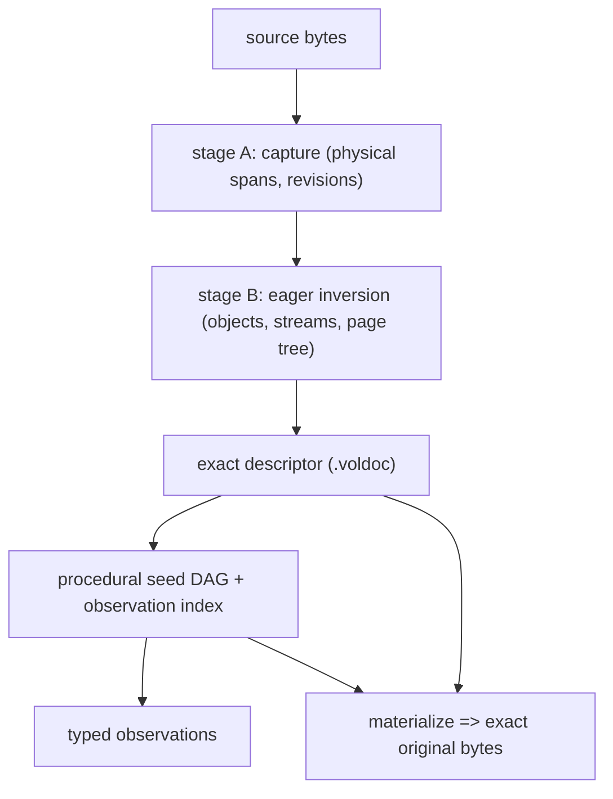

# Architecture overview

VOLE-Document is a reversible representation stack for a document's bytes. It
recovers a bounded deterministic reconstruction description — a reconstruction
program, typed residual channels, and typed entropy channels — persists that
recovered state as a queryable field, and materializes the exact original bytes
on demand.

This document is the entry point to the architecture set. Each sibling document
owns one concern and links the ADRs and phase results that carry the rationale
and receipts.

## The idea

The forward direction is ordinary: a file is opened, parsed, and rendered. VOLE
runs it backwards. It recovers the *computation that would produce these exact
bytes* and stores the computation instead of the file. Because the result is a
program, the persisted document can answer typed questions directly, without
re-opening, re-parsing, or re-rendering the source.

Two design commitments follow from that:

- **Exactness is the invariant, not a competitive claim.** The only normative
  profile is `materialize(descriptor) == original_bytes`. Parsing, semantic
  equality, canonicalization, rendering, and re-saving are never archival
  equality.
- **The representation is procedural, not statistical.** rANS is the entropy
  substrate *beneath* the representation; it is never the model. The project is
  deliberately not "a PDF optimizer that happens to use rANS".

## Pipeline

1. **Capture.** A byte-authoritative scanner covers the whole input with a
   contiguous span partition (no gap, no overlap). The source bytes are the
   authority; external tools are oracles only (ADR-0009).
2. **Inverse-proceduralize.** Recovery is progressive: a cheap eager inversion
   (objects, streams, page tree) followed by demand-driven deepening. The
   recovered computation is a bounded, non-Turing-complete program with a checked
   coverage certificate (ADR-0005).
3. **Persist.** The recovered state is stored as a content-addressed procedural
   seed DAG plus an advisory hierarchical observation index (ADR-0025).
4. **Observe / materialize.** A query resolves its minimum dependency closure and
   materializes as late as possible; the exact whole document is one observation
   among many (ADR-0024).

## Authority is layered

Five planes are kept distinct and never confused: exact reconstruction
(normative), procedural state (normative for observations), indexes (advisory),
derived caches (disposable), and trajectory/agent metadata (zero authority).
See [Authority and exactness](authority-and-exactness.md) and ADR-0024/ADR-0029.

## Prior art (frozen into the repository)

Independent Phase-0 research fixed the external building blocks (frozen into
ADRs 0006–0009):

- `ryg-rans-rs` exposes a safe manual byte-rANS decode API; the panicking
  convenience decoder is banned on the hostile path (ADR-0006).
- `preflate-rs` reconstructs a raw DEFLATE bitstream from `(plaintext,
  corrections)`; reconstruction can panic and allocate on hostile input, so it is
  isolated and bounded (ADR-0007/0016).
- `entropyfs` exposes an embeddable engine usable with `default-features = false`;
  it is an optional store backend, never required (ADR-0008).
- PDF xref entries are literal file offsets, incremental updates are an
  append-only revision chain, and `/Size` never decreases (ADR-0009).

## Where the results live

The measured structure courts (Phases 2–6) are in
[Inverse proceduralization](inverse-proceduralization.md). The persistent field
and its observations are in [The document field](document-field.md) and
[Observations and provenance](observations-and-provenance.md). Stores and caches
are in [Persistence and caching](persistence-and-caching.md). The multi-format
adapters are in [Multi-format adapters](multi-format-adapters.md). Consolidated
verdicts, including every recorded negative, are in
[Findings](../project/findings.md).
